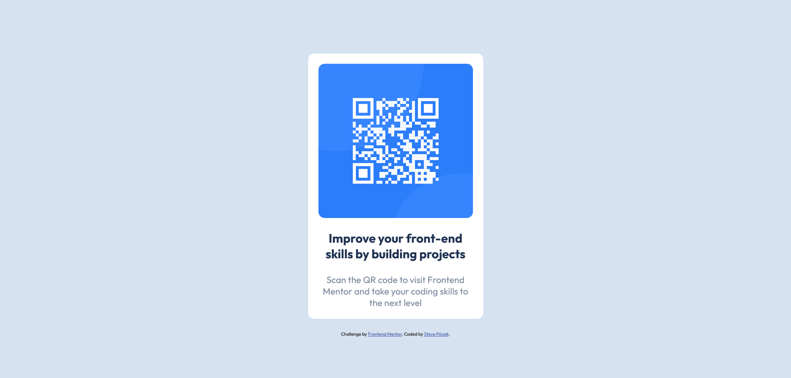

# Frontend Mentor - QR code component solution

This is a solution to the [QR code component challenge on Frontend Mentor](https://www.frontendmentor.io/challenges/qr-code-component-iux_sIO_H). Frontend Mentor challenges help you improve your coding skills by building realistic projects. 

## Overview

My first try in Frontend Mentor challenges.

### Screenshot

### Links

- Solution URL: [https://github.com/steve25/qr-code](https://github.com/steve25/qr-code)
- Live Site URL: [https://steve25.github.io/qr-code/](https://steve25.github.io/qr-code/)

### Built with

- HTML5
- CSS custom properties
- Flexbox
- Mobile-first workflow
